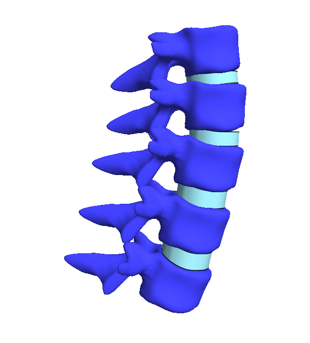

# LMG: Lumbar Model Generator

{:width="100%"}     

Cite LMG:    

# Table of contents
- [Project Summary](#Summary)  
- [Installation](#Installation)  
- [Getting started](#Start)  
- [License](#License)  
- [Contributing](#Contributing)  
- [Code of conduct](#CodeOfConduct)  
- [Road Map](#RoadMap)  

## Project summary 
Lumbar Model Generator (LMG) is a MATLAB toolbox ...

# Installation   
### 1. Installing 3rd party packages
Skip this step if finite element analysis with FEBio is not required.

| Package | Purpose | Included? | Download |
|:--|:--|:--:|--:|
|[__FEBio__](https://febio.org)   [{:height="100px"}](https://febio.org)|FEBio is a finite element solver and is used in LMG for all finite element analysis. |__No__|[__FEBio website__](https://febio.org) |
|[__GIBBON__](https://gibboncode.org)   [{:height="100px"}](https://gibboncode.org)|GIBBON The Geometry and Image-Based Bioengineering add-On |__No__|[__GIBBON website__](https://gibboncode.org) |
|  [__TetGen__]()   [{:height="100px"}](http://wias-berlin.de/software/tetgen/)|   Is used for tetrahedral meshing (and possibly constrained 3D Delaunay tessellation). `|__Yes__| For other versions: [__TetGen website__](http://wias-berlin.de/software/tetgen/)|

### 2. Run `install_LMG.m`
By running `install_LMG.m` the LMG and FEBio (if needed) path definitions will be added and saved to MATLAB. The help and documentation will also be integrated. Once finished you will be asked to __restart MATLAB__. `install_LMG.m` can be found in the main LMG folder.

## Getting started 

##### Access the integrated help
* To access the help documentation from MATLAB click on the HELP browser then click o `LMG toolbox` under `Supplemental Software`. This will open the toolbox help and documentation which is now searchable and integrated just like the rest of MATLAB's help and documentation.  

## License 

## Contributing 
Coming soon

## Code of conduct 
Coming soon

## Roadmap 
Coming soon
